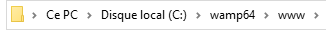
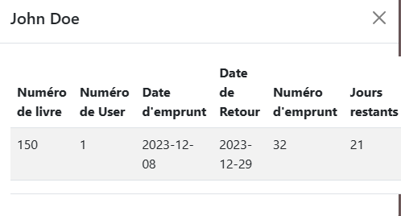
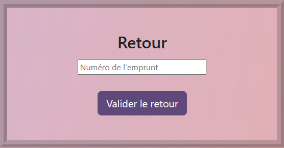

# Projet Bibliothèque

## Description du projet

Réaliser une application pour la gestion d'une bibliothèque.

### Fonctionnalités de l'application :

- Afficher la liste des livres (numéro d'identification, titre, auteur, résumé, catégorie, statut)
- Afficher la liste des utilisateurs (numéro d'identification, nom, prénom)
- Afficher la liste des emprunts (numéro d'identification, ID du livre, ID de l'utilisateur, date emprunt, date retour, nombre de jours restants)
- Ajouter, modifier ou supprimer un livre
- Ajouter un utilisateur
- Enregistrer un emprunt ou un retour

## Installation et exécution du projet

1. Importer le fichier SQL dans phpMyAdmin (la base de données devra être nommée "bibliotheque"). 
    
2. Coller le dossier "bibliotheque" dans "Ce PC -> Disque local (C:) -> wamp -> www". 
    
3. Accéder à [localhost/bibliotheque](http://localhost/bibliotheque) dans la barre de navigation. 
    

## Comment utiliser le projet

En arrivant sur le site, la première page correspond au tableau des livres. À gauche de ce tableau, vous disposez de 3 boutons : 

- **Livres** (sélectionné par défaut) : permet d'afficher la liste des livres et les informations globales. Lorsque vous cliquez sur une ligne, les informations complémentaires apparaissent. 

- **Utilisateurs** : permet d'afficher la liste des différents utilisateurs (les personnes qui empruntent les livres). Lorsque vous cliquez sur une ligne, l'historique des emprunts apparaît. 

- **Emprunts** : permet d'afficher la liste des emprunts effectués. Lorsque vous cliquez sur une ligne, des informations complémentaires au livre et à l'utilisateur apparaissent. 

Selon l'option sélectionnée ci-dessus (Livres, Utilisateurs, Emprunts), vous disposez d'autres options un peu plus bas sur la page :

- **Livres** :
    - Ajouter un livre  
        
    - Modifier un livre  
        
    - Supprimer un livre  
        

- **Utilisateurs** :
    - Ajouter un utilisateur  
        

- **Emprunts** :
    - Enregistrer un emprunt  
        
    - Enregistrer un retour  
        

## Réalisé par

- Alexandre Mouchez : Chef de Projet
- Zacharie Zimmer : Développeur en chef
- Nicolas Jeangeorges : Développeur
- Lilly Burtin : Développeur
